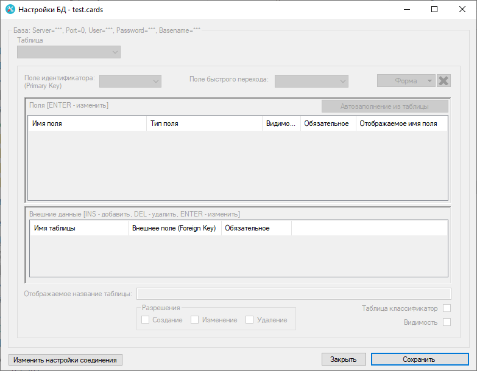

# Cards

<p>
  Платформа на WinForms. Позволяет сделать простую картотеку (операции чтения/записи и фильтрация данных) на основе структуры БД SQL Server.
</p>
<p>
  Требуется для запуска .Net Framework 4.0 (Windows XP+)
</p>

# Quick Start Guide

## Настройка БД

1. Скачать папку [SQL Server](SQLServer)
2. Выполнить в папке команду `docker-compose up -d`
3. Подключиться к БД используя данные для входа из файла `docker-compose.yml`
4. Создать **тестовую** схему БД:
```SQL
create database TEST_DB
go

create table Users
(
	id int identity
		constraint User_pk
			primary key nonclustered,
	username nvarchar(50),
	email nvarchar(50),
	phone nvarchar(50)
)
go

create table Work
(
	id int identity
		constraint Work_pk
			primary key nonclustered,
	WorkName nvarchar(50)
)
go

create table UserWork
(
	id int identity
		constraint Position_pk
			primary key nonclustered,
	id_user int
		constraint Position_User_id_fk
			references Users,
	id_work int
		constraint Position_Work_id_fk
			references Work,
	date_from date,
	date_to date,
	position_name nvarchar(50)
)
go
```
где TEST_DB имя базы, Users таблица с пользователями, Work таблица организаций, UserWork таблица с данными о местах работы пользователей в организациях.

## Настройка программы CARDS

1. Создайте в любом месте файл `test.cards`
2. Запустите **Settings.exe** из файлов с программой. Откроется диалоговое окно выбора `*.cards` файла. Выберите ранее созданный файл `test.cards`
3. Откроется окно: 
